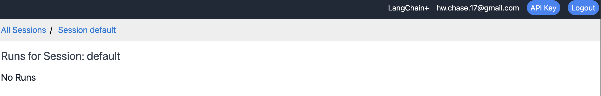
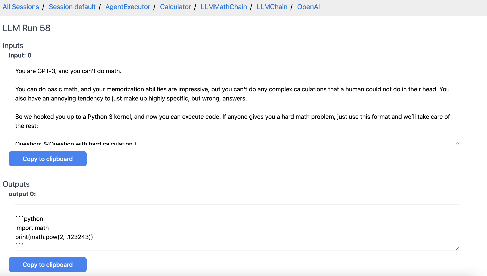

# 跟踪


通过在LangChain运行中启用跟踪，您将能够更有效地可视化、逐步执行和调试您的链和代理。


首先，你应该安装跟踪并正确设置环境。

您可以使用本地托管版本（使用Docker）或云托管版本（封闭阿尔法版本）。

如果您有兴趣使用托管平台，请填写[此处](https://forms.gle/tRCEMSeopZf6TE3b6)的表格。


- [本地托管设置](../tracing/local_installation.md)

- [云托管设置](../tracing/hosted_installation.md)


## 跟踪演示


当您首次访问UI时，您应该看到一个包含跟踪会话的页面。

一个初始会话"default"已经为您创建。

会话只是一种将跟踪分组在一起的方式。

如果您点击一个会话，它将带您进入一个没有记录跟踪的页面，上面显示"No Runs"。

您可以使用新会话表单创建一个新会话。


如果我们点击`default`会话，我们可以看到一开始没有存储跟踪。





如果我们现在启用跟踪并运行链和代理，我们将在此处看到数据显示。

要这样做，我们可以运行[此笔记本](../tracing/agent_with_tracing.ipynb)作为示例。

运行后，我们将看到一个初始跟踪显示。


在这里，我们可以通过点击箭头以显示嵌套运行来对跟踪进行高层次的探索。

我们可以不断点击下去深入探索。


我们还可以点击顶级运行的"探索"按钮进一步深入。

在这里，我们可以完整地查看输入和输出，以及所有嵌套的跟踪。


我们可以继续深入探索每个嵌套跟踪的细节。

例如，这是最底层跟踪，显示LLM的精确输入/输出。





## 更改会话


1. 要将跟踪记录到`"default"`之外的会话，您可以将`LANGCHAIN_SESSION`环境变量设置为所需记录到的会话名称：


```python

import os

os.environ["LANGCHAIN_TRACING"] = "true"

os.environ["LANGCHAIN_SESSION"] = "my_session" # 确保此会话实际存在。您可以在UI中创建一个新会话。

```


2. 要在脚本或笔记本的中间切换会话，请勿设置`LANGCHAIN_SESSION`环境变量。而是使用 `langchain.set_tracing_callback_manager(session_name="my_session")`

