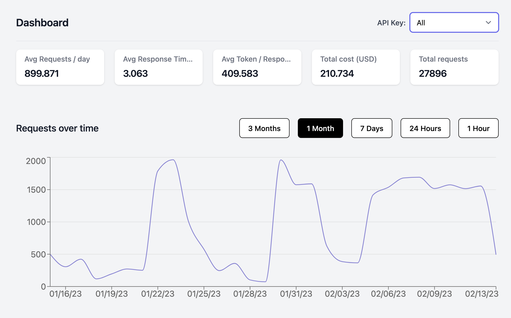
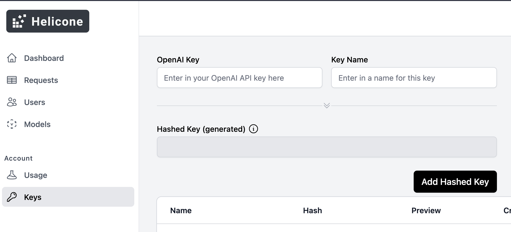

Helicone（螺旋圆锥）

本页面介绍了如何在LangChain内使用[Helicone](https://helicone.ai)生态系统。

## Helicone是什么？

Helicone是一个[开源](https://github.com/Helicone/helicone)的可观察性平台，代理您的OpenAI流量并为您提供关键洞察，以了解您的支出、延迟和使用情况。



## 快速入门

在您的LangChain环境中，您只需添加以下参数。

```bash
export OPENAI_API_BASE="https://oai.hconeai.com/v1"

```


现在请前往[helicone.ai](https://helicone.ai/onboarding?step=2)创建您的帐户，并在我们的控制台中添加您的OpenAI API密钥以查看日志。



## 如何启用Helicone缓存

```python
from langchain.llms import OpenAI

import openai

openai.api_base = "https://oai.hconeai.com/v1"


llm = OpenAI(temperature=0.9, headers={"Helicone-Cache-Enabled": "true"})

text = "What is a helicone?"

print(llm(text))

```


[Helicone缓存文档](https://docs.helicone.ai/advanced-usage/caching)

## 如何使用Helicone自定义属性

```python
from langchain.llms import OpenAI

import openai

openai.api_base = "https://oai.hconeai.com/v1"


llm = OpenAI(temperature=0.9, headers={

        "Helicone-Property-Session": "24",

        "Helicone-Property-Conversation": "support_issue_2",

        "Helicone-Property-App": "mobile",

      })

text = "What is a helicone?"

print(llm(text))

```


[Helicone property docs](https://docs.helicone.ai/advanced-usage/custom-properties)

